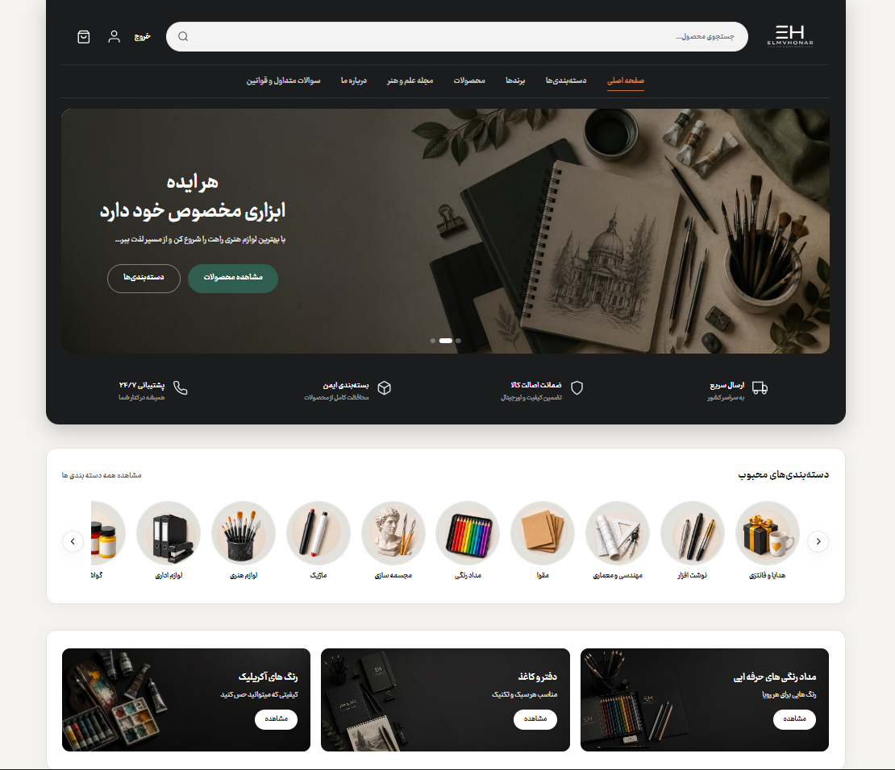
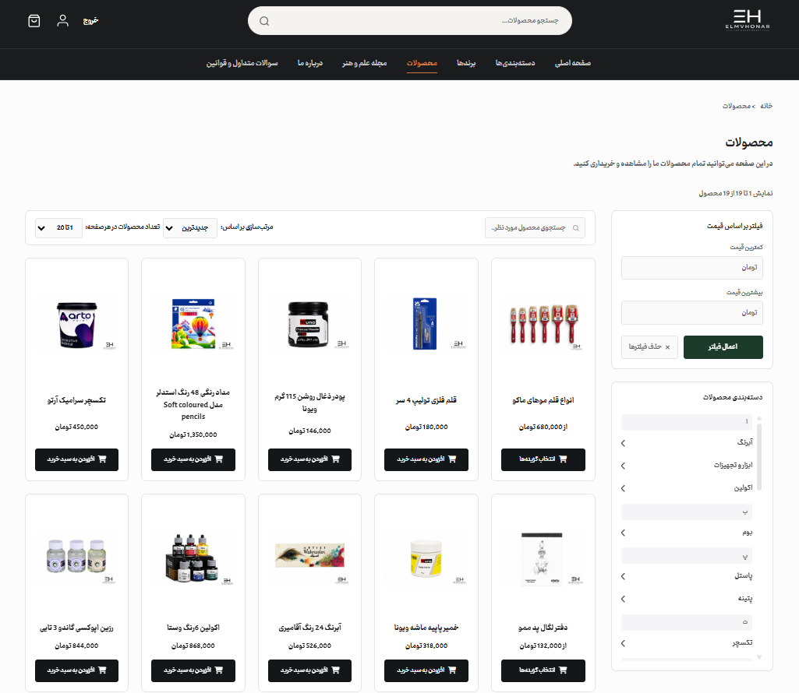
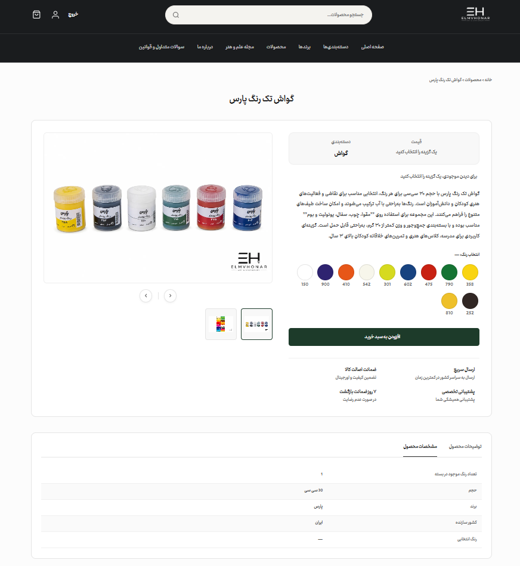
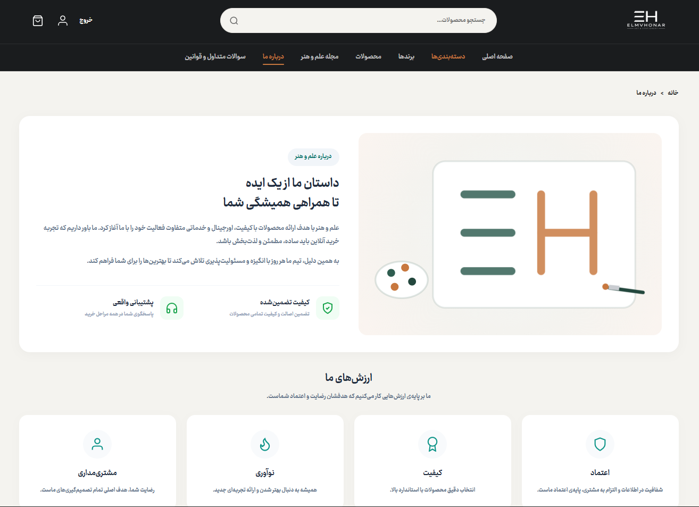
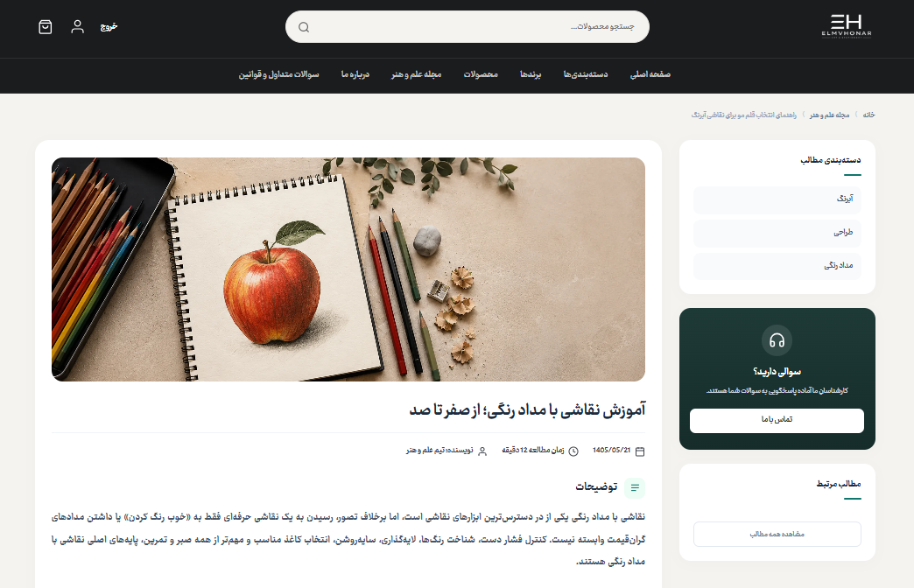

<div align="center">

# 🎨 علم و هنر | Elm Va Honar

**فروشگاه آنلاین تخصصی لوازم هنری، نقاشی و نوشت‌افزار**


</div>

---

## 📖 درباره پروژه

**علم و هنر** یک وب‌سایت فروشگاهی کامل و تولیدی (Production) برای فروش لوازم هنری، نقاشی، ماکت‌سازی، مجسمه‌سازی و نوشت‌افزار است که با هدف ارائه‌ی یک تجربه‌ی خرید آنلاین ساده، مطمئن و لذت‌بخش طراحی و توسعه داده شده. این پروژه از ابتدا تا استقرار نهایی (Deployment) به‌صورت دو نفره پیاده‌سازی شده و در حال حاضر به‌عنوان فروشگاه آنلاین رسمی مجموعه‌ی **نوشت‌افزار علم و هنر** (واقع در کرج، مهرشهر) فعال است.

---

## ✨ امکانات و ویژگی‌ها

### 🛍️ فروشگاه و محصولات

- نمایش محصولات با دسته‌بندی، فیلتر بر اساس قیمت و مرتب‌سازی
- پشتیبانی کامل از **Variant** محصولات (رنگ، سایز و ...) با نمایش پالت رنگی و انتخاب لحظه‌ای قیمت/موجودی/مشخصات
- سیستم تخفیف با محاسبه‌ی خودکار درصد و قیمت نهایی
- گالری تصاویر با اسلایدر برای هر محصول
- سبد خرید مبتنی بر Session و همچنین دیتابیس، با قابلیت ادغام سبد هنگام ورود کاربر (Merge on Login)

### 💳 پرداخت

- اتصال به درگاه پرداخت **زرین‌پال (ZarinPal)**
- مدیریت Idempotency و کنترل هم‌زمانی با `select_for_update()` برای جلوگیری از خطای موجودی در تراکنش‌های همزمان
- به‌روزرسانی خودکار موجودی انبار پس از تأیید پرداخت

### 👤 حساب کاربری

- ثبت‌نام و ورود از طریق شماره موبایل با پنل پیامکی **کاوه‌نگار**
- پنل اختصاصی مشتری شامل:
  - مشاهده و ویرایش مشخصات کاربری
  - بازنشانی رمز عبور (Reset Password)
  - مشاهده تاریخچه و جزئیات سفارش‌ها
  - افزودن، ویرایش و حذف آدرس‌های چندگانه

### 📝 محتوا

- بخش مجله (بلاگ) با مقالات آموزشی درباره‌ی کار با ابزارهای هنری
- تنظیمات SEO شامل متاتگ‌ها، Sitemap، robots.txt و Schema.org (JSON-LD)
- صفحه «درباره ما» با معرفی تیم و موقعیت فروشگاه روی نقشه گوگل

### 🎨 رابط کاربری

- طراحی کاملاً واکنش‌گرا (Responsive) و راست‌به‌چپ (RTL)
- فونت وزیرمتن و تم تیره با رنگ‌بندی بنفش/سبز
- پنل مدیریت (Django Admin) با تم اختصاصی تیره/بنفش و فرم‌های Bulk Action

---

## 🛠️ تکنولوژی‌های استفاده‌شده

| بخش                      | تکنولوژی                          |
| ------------------------ | --------------------------------- |
| **بک‌اند**               | Django 5.2.8                      |
| **پایگاه داده**          | PostgreSQL                        |
| **فرانت‌اند**            | HTML5, CSS3, JavaScript (Vanilla) |
| **کانتینرسازی**          | Docker, Docker Compose            |
| **سرور اپلیکیشن**        | Gunicorn                          |
| **فایل‌های استاتیک**     | WhiteNoise                        |
| **درگاه پرداخت**         | ZarinPal (Sandbox/Production)     |
| **پنل پیامکی**           | کاوه‌نگار (Kavenegar)             |
| **استقرار (Deployment)** | Runflare                          |

---

## 🖼️ تصاویر پروژه

<div align="center">

**صفحه اصلی**



**صفحه محصولات**



**صفحه جزئیات محصول (با پالت رنگی Variant)**



**صفحه درباره ما و موقعیت روی نقشه**



**بخش مجله علم و هنر**



</div>

---

## 🚀 نصب و راه‌اندازی

### پیش‌نیازها

- [Docker](https://www.docker.com/) و Docker Compose
- Git

### مراحل نصب

```bash
# کلون کردن پروژه
git clone https://github.com/Komeil-Ahankoobi/Elm-Va-Honar.git
cd Elm-Va-Honar

# تنظیم فایل‌های محیطی (env) در پوشه envs/

# بالا آوردن سرویس‌ها با Docker Compose
docker compose up --build
```

پس از بالا آمدن کانتینرها، مهاجرت‌های دیتابیس را اجرا کنید:

```bash
docker compose exec django python manage.py migrate
docker compose exec django python manage.py createsuperuser
```

پروژه به‌صورت پیش‌فرض روی آدرس زیر در دسترس خواهد بود:

```
http://localhost:8000
```

---

## 📁 ساختار پروژه

```
Elm-Va-Honar/
├── core/                     # هسته‌ی اصلی پروژه‌ی Django (اپ‌ها، تنظیمات، مدل‌ها)
├── dockerfiles/dev/django/   # Dockerfile مربوط به محیط توسعه
├── docs/                     # مستندات و تصاویر پروژه
├── envs/                     # فایل‌های متغیرهای محیطی
├── docker-compose.yml        # تنظیمات Docker Compose
├── requirements.txt          # وابستگی‌های Python
└── README.md
```

---

## 👥 تیم توسعه

این پروژه از صفر تا استقرار نهایی، حاصل تلاش مشترک دو نفر است:

<div align="center">

<table>
  <tr>
    <td align="center" width="300">
      <br/>
      <b>کمیل آهنکوبی</b><br/>
      <sub>💻 Web Developer</sub><br/><br/>
      <a href="https://github.com/Komeil-Ahankoobi"></a>
    </td>
    <td align="center" width="300">
      <br/>
      <b>علی آرزومندی</b><br/>
      <sub>💻 Web Developer</sub><br/><br/>
      <a href="https://github.com/Ali-Arezoomandi"></a>
    </td>
  </tr>
</table>

</div>

---

## 📄 لایسنس

این پروژه تحت لایسنس **MIT** منتشر شده است. برای اطلاعات بیشتر فایل [LICENSE](./LICENSE) را مشاهده کنید.

---

<div align="center">

ساخته‌شده با ❤️ توسط تیم علم و هنر

</div>
